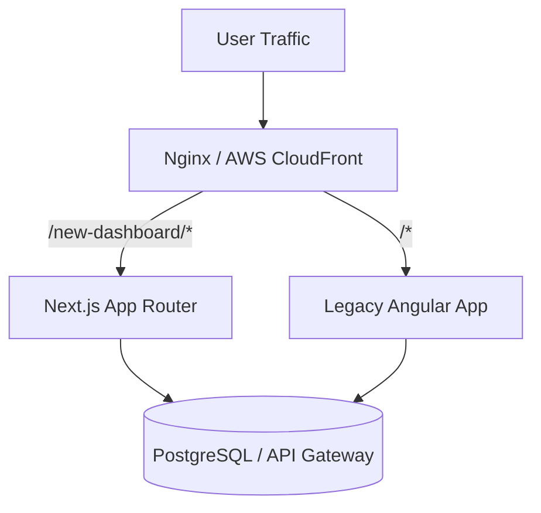

```json
{
  "title": "Migrating Legacy Angular and Vue to Next.js: A 5-Step Playbook",
  "metaDescription": "A complete technical playbook for migrating legacy Angular and Vue systems to Next.js. Learn how to estimate vue to react migration cost and execute safely.",
  "slug": "migrate-angular-vue-to-nextjs-playbook",
  "keywords": ["migrate angular to nextjs", "vue to react migration cost", "next.js migration strategy", "strangler fig pattern frontend", "enterprise frontend modernization"],
  "category": "Engineering",
  "accent": "#3B82F6"
}
```


<!-- Midjourney Prompt: A clean isometric 3D render of a futuristic web application interface, glowing translucent code layers floating in dark space, neon blue and cyan lights casting subtle reflections, minimal glassmorphism dashboard, octane render, 8k resolution, ultra detailed, tech product aesthetic --ar 16:9 -->

We recently completed a 14-month engagement migrating a core financial dashboard for a European enterprise client from a heavily bloated Angular 11 monolith to a modern Next.js App Router architecture. The initial system was plagued by 8.5-second initial load times, a sluggish Time to Interactive (TTI), and an incredibly steep onboarding curve for new engineers. By the end of the transition, we achieved a 74% reduction in LCP (Largest Contentful Paint) and drastically lowered their ongoing maintenance overhead.

Migrating an enterprise application is rarely a simple rewrite. A "big bang" rewrite is the fastest way to burn runway and stall product development. Instead, executing a safe, incremental migration requires a calculated architectural strategy. 

In this playbook, our team at NimbleSL breaks down the exact 5-step process we use to migrate legacy Angular and Vue systems to Next.js without halting feature delivery.

## 📋 Table of Contents
1. [The Strangler Fig Pattern in Frontend Architectures](#the-strangler-fig-pattern-in-frontend-architectures)
2. [Step 1: Establishing the Migration Infrastructure](#step-1-establishing-the-migration-infrastructure)
3. [Step 2: Component Decoupling & Micro-Frontends](#step-2-component-decoupling--micro-frontends)
4. [Step 3: State Management Translation](#step-3-state-management-translation)
5. [Step 4: Routing and Traffic Splitting](#step-4-routing-and-traffic-splitting)
6. [Step 5: Decommissioning the Legacy Monolith](#step-5-decommissioning-the-legacy-monolith)
7. [Calculating Vue to React Migration Cost](#calculating-vue-to-react-migration-cost)

## The Strangler Fig Pattern in Frontend Architectures

The Strangler Fig pattern involves placing an intercepting routing layer in front of the legacy application. As you build new Next.js pages, the router directs traffic to the new system, while unmigrated routes fall back to the legacy Angular/Vue app. 

> [!IMPORTANT]  
> Never pause feature development for a migration. The business cannot afford a 6-month freeze. The Strangler Fig pattern ensures you can ship new Next.js features immediately while slowly cannibalizing the old codebase.

### The Architectural Blueprint



## Step 1: Establishing the Migration Infrastructure

The first step is configuring the reverse proxy. You need a mechanism to route traffic based on URL paths. We typically use AWS CloudFront or an Nginx ingress controller in Kubernetes.

Here is a concrete example of an Nginx configuration that routes traffic between a Next.js app and a legacy Angular app:

```nginx
server {
    listen 80;
    server_name app.enterprise.com;

    # Route new rewritten pages to Next.js
    location /dashboard/v2/ {
        proxy_pass http://nextjs-upstream;
        proxy_http_version 1.1;
        proxy_set_header Upgrade $http_upgrade;
        proxy_set_header Connection 'upgrade';
        proxy_set_header Host $host;
        proxy_cache_bypass $http_upgrade;
    }

    # Default fallback to legacy Angular
    location / {
        proxy_pass http://angular-legacy-upstream;
        proxy_set_header Host $host;
    }
}
```

By defining explicit paths for the new Next.js infrastructure, we ensure zero disruption to the existing user base. 

## Step 2: Component Decoupling & Micro-Frontends

Before writing any React code, you must decouple the legacy logic. Angular heavily relies on two-way data binding and complex RxJS observable chains. Vue uses mutable reactive state. React, conversely, enforces unidirectional data flow.

### The Migration Mapping

| Legacy Concept | Next.js / React Equivalent | Complexity of Translation |
|---|---|---|
| Angular Services (DI) | React Context / Custom Hooks | High |
| Vuex / NgRx | Zustand / Redux Toolkit | Medium |
| RxJS Streams | React Query / SWR / Async Hooks | High |
| Angular Directives | Higher-Order Components / Hooks | Medium |

When translating an Angular component to React, focus on extracting the pure API fetching logic out of the component and into React Server Components (RSC) or a robust client-side library like React Query.

```tsx
// Modern React implementation replacing complex RxJS subscriptions
import { useQuery } from '@tanstack/react-query';

export function DashboardMetrics() {
  // We extract the data fetching into a clean, cached hook
  const { data, isLoading, error } = useQuery({
    queryKey: ['financial-metrics'],
    queryFn: async () => {
      const res = await fetch('/api/metrics');
      if (!res.ok) throw new Error('Network response was not ok');
      return res.json();
    }
  });

  if (isLoading) return <MetricsSkeleton />;
  if (error) return <ErrorFallback error={error} />;

  return (
    <div className="grid grid-cols-4 gap-4">
      {data.map(metric => (
        <MetricCard key={metric.id} {...metric} />
      ))}
    </div>
  );
}
```

## Step 3: State Management Translation

One of the most complex parts of migrating from Vue to React is shifting from Vuex to a modern React state manager. While Redux was the standard years ago, we now default to **Zustand** for 90% of our enterprise migrations. It provides a lightweight, unopinionated store that closely mimics the simplicity of Vue's reactivity model without the boilerplate of Redux.

> [!TIP]
> Do not attempt to share state between the legacy app and the Next.js app on the client side. State should be synced via the backend database or URL query parameters, or stored in HTTP-only cookies if it relates to authentication.

## Step 4: Routing and Traffic Splitting

With Next.js App Router, handling the incremental rollout is incredibly efficient. However, you must handle authentication sharing. 

If the legacy app uses JWT tokens stored in `localStorage`, the Next.js application will not be able to read them easily across subdomains, or it requires complex client-side synchronization. The professional approach is to migrate authentication state to HTTP-only cookies before the migration begins.

```typescript
// Next.js 15 Middleware for Auth Check across the Strangled App
import { NextResponse } from 'next/server';
import type { NextRequest } from 'next/server';

export function middleware(request: NextRequest) {
  const token = request.cookies.get('enterprise_auth_token');

  // If no token exists, redirect to the legacy login page
  if (!token && request.nextUrl.pathname.startsWith('/dashboard/v2')) {
    return NextResponse.redirect(new URL('/login', request.url));
  }

  return NextResponse.next();
}

export const config = {
  matcher: ['/dashboard/v2/:path*'],
};
```

## Step 5: Decommissioning the Legacy Monolith

As the Next.js footprint grows, the Angular/Vue footprint shrinks. The final step is decommissioning. Once 100% of the routes are handled by Next.js, the Nginx routing rules are removed, the legacy deployment pipelines are shut down, and the old repository is archived.

In our recent migration, the final decommissioning reduced infrastructure costs by 22% simply by dropping the heavy, over-provisioned legacy application servers.

## Calculating Vue to React Migration Cost

Estimating the "vue to react migration cost" or the cost of moving off Angular requires assessing three primary variables:

1. **Lines of Code (LOC):** A 100,000 LOC Angular application typically requires 3-5 months of engineering time from a senior team.
2. **Business Logic Density:** Are calculations done on the frontend? If so, they must be moved to the backend before the migration.
3. **Component Reusability:** Building a clean UI token system (Figma to Code) prior to the migration drastically reduces the cost.

At NimbleSL, we specialize in high-complexity enterprise migrations. By leveraging our elite Dhaka-based engineering teams, we execute Next.js migrations with world-class precision at 60-70% lower TCO compared to US/UK agencies. 

**Is your legacy frontend slowing down your feature velocity?** [Schedule a technical consultation](/contact) with our architecture team to discuss a safe, incremental migration strategy.
