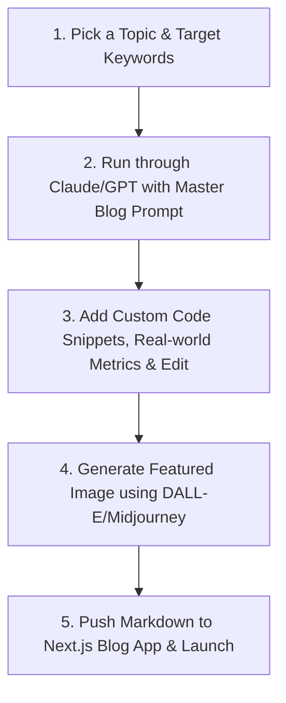

# 🚀 NimbleSL SEO Blog Strategy, 50-Topic Roadmap & Master Content Engine

This document outlines the complete SEO Blog Strategy, a comprehensive **50-Topic Content Roadmap** across 6 core technical clusters, and a **Master Blog Prompt** designed to act as an automated, world-class content generation engine for **Nimble Software Lab (NimbleSL)**.

---

## 🎯 The Content Strategy & Brand Positioning

To win enterprise clients, startups, and high-growth companies looking for high-quality software development partners, NimbleSL's content must reject generic marketing fluff. The positioning must reflect:
1. **Uncompromised Technical Excellence:** Written from the perspective of **Senior Staff Engineers and Architects** who have shipped 50+ enterprise products across 12 countries.
2. **The "Elite Offshore" Advantage:** Actively addressing the cost savings (60-70% TCO reduction) while emphasizing that the team consists of top-tier local talent (e.g., BUET graduates, ex-FAANG) with hiring standards harder than big tech.
3. **Product-Led Growth (PLG):** Seamlessly soft-promoting **NimbleBot** (Enterprise RAG Chatbots) to build a waitlist pipeline.
4. **Agility and Speed:** Advocating the **NimbleSL 8-Week MVP Sprint Framework** as the gold standard for rapid launching.

---

## 📂 Part 1: The 50-Topic SEO Content Roadmap

Each topic below is specifically engineered for high-intent search terms used by CTOs, VPs of Engineering, Product Managers, and Founders.

---

### 🌐 Cluster 1: Modern Web Engineering & Next.js (10 Topics)
*Focus: Showcasing elite frontend and backend web architecture skills.*

| # | SEO Blog Title | Target Keywords | User Intent / Target Audience | Internal Linking & Promotion |
|---|---|---|---|---|
| 1 | **Next.js 15 App Router: The Definitive Performance Tuning Checklist** | `next.js 15 performance optimization`, `app router speed` | Informational / CTOs, Frontend Leads | Link to *Web Applications Service* |
| 2 | **Server Actions vs. Route Handlers: Architectural Tradeoffs in Next.js** | `nextjs server actions vs route handlers`, `api design nextjs` | Technical / Senior Engineers | Link to *Custom Solutions Service* |
| 3 | **Building Secure Multi-Tenant SaaS with Next.js and Supabase Row Level Security** | `multi tenant saas supabase rls`, `nextjs multi tenancy` | High-Intent / SaaS Founders, Architects | Link to *Cloud Solutions Service* |
| 4 | **How to Eliminate Layout Shift (CLS) in Dynamic React Dashboards** | `reduce cumulative layout shift react`, `cls optimization` | Technical / Frontend Devs, UX Designers | Link to *UI/UX Design Service* |
| 5 | **React Server Components (RSC) vs. Traditional SSR: An Empirical Cost-Benefit Analysis** | `react server components vs ssr`, `rsc performance` | Informational / Tech Leads | Link to *Web Applications Service* |
| 6 | **Next.js Caching Deep-Dive: Navigating Data Cache, Full Route Cache, and Router Cache** | `nextjs cache invalidation`, `opt out nextjs cache` | Deep-Technical / Tech Leads | Link to *Web Applications Service* |
| 7 | **Incremental Static Regeneration (ISR) at Scale: Handling 1 Million Pages Without Server Latency** | `nextjs isr scale`, `static regeneration hosting` | Technical / VPs of Engineering | Link to *Cloud Solutions Service* |
| 8 | **Migrating Legacy Angular and Vue Systems to Next.js: A 5-Step Migration Playbook** | `migrate angular to nextjs`, `vue to react migration cost` | Transactional / enterprise CTOs | Link to *Custom Solutions (Migration)* |
| 9 | **State Management in 2026: Why We Swapped Redux for Zustand in Production** | `zustand vs redux 2026`, `react state management production` | Informational / Web Architects | Link to *Web Applications Service* |
| 10 | **Configuring a Zero-Configuration CI/CD Pipeline for Next.js on AWS (SST vs. Vercel)** | `nextjs aws deployment sst`, `vercel vs aws nextjs` | High-Intent / DevOps Leads | Link to *Cloud Solutions Service* |

---

### 🤖 Cluster 2: AI/ML, Generative AI & Intelligent Agents (10 Topics)
*Focus: Portraying NimbleSL as a cutting-edge pioneer in AI, featuring vector search and promoting **NimbleBot**.*

| # | SEO Blog Title | Target Keywords | User Intent / Target Audience | Internal Linking & Promotion |
|---|---|---|---|---|
| 11 | **Enterprise RAG: Moving from Naive Vector Search to Hybrid Retrieval (95%+ Accuracy)** | `enterprise rag hybrid search`, `vector database reranker` | High-Intent / AI Leads, Enterprise CTOs | **Promote NimbleBot** (Waitlist) |
| 12 | **Vector Database Comparison: pgvector vs. Pinecone vs. Qdrant for Scale** | `pgvector vs pinecone`, `best vector database for rag` | Informational / Systems Architects | **Promote NimbleBot** (Waitlist) |
| 13 | **Fine-Tuning vs. Few-Shot Prompting: When is a Custom LLM Actually Worth the Cost?** | `fine tuning vs few shot prompting`, `custom llm cost` | Transactional / Technical Founders | Link to *AI & ML Solutions Service* |
| 14 | **Building Agentic Workflows: Implementing LangGraph and Semantic Routing in SaaS** | `agentic workflow langgraph`, `semantic routing llm` | Deep-Technical / AI Engineers | Link to *AI & ML Solutions Service* |
| 15 | **How to Build a Custom Customer Support Bot Trained on Enterprise PDFs** | `custom chatbot enterprise documents`, `pdf support bot` | Transactional / Operations Managers | **Promote NimbleBot** (Waitlist) |
| 16 | **Reducing OpenAI API Costs by 60%: A Guide to Semantic Caching and Local LLM Fallbacks** | `reduce openapi api cost`, `semantic caching llm` | Cost-Focus / Startups, CTOs | Link to *AI & ML Solutions Service* |
| 17 | **Evaluating RAG Systems: Automating Faithfulness and Context Recall Checks** | `rag evaluation ragas`, `evaluate chatbot accuracy` | Informational / AI Product Managers | **Promote NimbleBot** (Waitlist) |
| 18 | **Computer Vision at the Edge: Deploying Defect Detection Models on NVIDIA Jetson** | `defect detection nvidia jetson`, `edge computer vision` | High-Intent / Industrial CTOs | Link to *AI & ML Solutions Service* |
| 19 | **Securing LLM Integrations: Preventing Prompt Injections and PII Leaks in Production** | `prevent prompt injection llm`, `secure enterprise rag` | High-Intent / Security Officers | **Promote NimbleBot** (Waitlist) |
| 20 | **The Future of Search: Implementing Semantic Search Over Large eCommerce Catalogues** | `semantic search ecommerce`, `product search embeddings` | Transactional / Retail Founders | Link to *AI & ML Solutions Service* |

---

### 📱 Cluster 3: Mobile App Engineering & Offline-First (8 Topics)
*Focus: Elevating cross-platform mobile engineering authority.*

| # | SEO Blog Title | Target Keywords | User Intent / Target Audience | Internal Linking & Promotion |
|---|---|---|---|---|
| 21 | **Offline-First Flutter Architecture: Implementing Drift and SQLite at Scale** | `offline first flutter drift`, `sqlite flutter sync` | Technical / Mobile Tech Leads | Link to *Mobile Apps Service* |
| 22 | **Flutter vs. React Native in 2026: An Honest Performance and Cost Comparison** | `flutter vs react native 2026`, `best cross platform mobile` | Informational / Startup Founders | Link to *Mobile Apps Service* |
| 23 | **Handling Complex Sync Conflicts in Local-First Mobile Apps** | `offline mobile sync conflict resolution`, `vector clocks mobile` | Deep-Technical / Mobile Architects | Link to *Mobile Apps Service* |
| 24 | **Optimizing App Store Size: Core Techniques for Slimming Down Flutter & RN Bundles** | `reduce flutter app size`, `slim react native ipa` | Technical / Mobile Developers | Link to *Mobile Apps Service* |
| 25 | **Background Syncing in iOS & Android: Battling OS Suspension Rules** | `flutter workmanager background sync`, `ios background fetch` | Technical / Senior Mobile Devs | Link to *Mobile Apps Service* |
| 26 | **Building Premium Micro-Interactions in Mobile Apps: Skia vs. Lottie** | `flutter skia micro interactions`, `react native lottie performance` | High-Intent / Mobile Product Managers | Link to *UI/UX Design Service* |
| 27 | **Automating App Store & Google Play Deployments Using Fastlane and GitHub Actions** | `fastlane automatic app store deployment`, `cicd mobile apps` | High-Intent / DevOps Engineers | Link to *Mobile Apps Service* |
| 28 | **Securing Mobile Storage: Best Practices for Keychain and Keystore Integration** | `secure mobile storage keychain flutter`, `react native keystore` | Informational / Security Leads | Link to *Mobile Apps Service* |

---

### 📊 Cluster 4: Enterprise Solutions, Cloud & Infrastructure (8 Topics)
*Focus: Targeting enterprise IT decision makers, database performance, scaling, security, and cloud automation.*

| # | SEO Blog Title | Target Keywords | User Intent / Target Audience | Internal Linking & Promotion |
|---|---|---|---|---|
| 29 | **Scaling PostgreSQL to 100 Million Rows: Partitioning, Indexing, and Connection Pooling** | `scale postgresql 100 million rows`, `pgbouncer optimization` | Deep-Technical / Database Admins | Link to *Cloud Solutions Service* |
| 30 | **Monolithic Databases vs. Distributed Databases: Tradeoffs in Scaling Global Enterprise Applications** | `monolithic vs distributed databases`, `horizontal scaling database` | Informational / Systems Architects | Link to *Custom Solutions Service* |
| 31 | **Transitioning from Modular Monolith to Microservices: Concrete Metrics of When to Migrate** | `monolith to microservices migration metrics`, `modular monolith` | Informational / CTOs, Tech Architects | Link to *Custom Solutions Service* |
| 32 | **Building Resilient Serverless APIs: Cold Starts, Caching, and Fault Tolerance in Production** | `serverless api architecture`, `aws lambda performance` | Technical / Backend Engineers | Link to *Cloud Solutions Service* |
| 33 | **Securing Enterprise Databases: Implementing Audit Trails, Dynamic Masking, and Column Encryption** | `database encryption audit trail`, `secure postgresql` | High-Intent / Enterprise Security Leads | Link to *Cloud Solutions Service* |
| 34 | **The Complete Guide to Multi-Tenant Database Architecture: Separate Schema vs. Shared Database** | `multi tenant database architecture postgres`, `tenant isolation` | Deep-Technical / Systems Architects | Link to *Cloud Solutions Service* |
| 35 | **Deploying Auto-Scaling Kubernetes Clusters on AWS (EKS) for High-Volume Systems** | `aws eks auto scaling tutorial`, `kubernetes enterprise deployment` | High-Intent / Platform Engineers | Link to *Cloud Solutions Service* |
| 36 | **Cost Optimization in AWS: How to Identify and Eliminate Resource Leaks and Over-Provisioning** | `reduce aws bill optimization`, `identify idle aws resources` | Cost-Focus / CFOs, CTOs | Link to *Cloud Solutions Service* |

---

### 💼 Cluster 5: Offshore Product Development & Strategy (8 Topics)
*Focus: Educating startups and enterprises on offshore success, promoting NimbleSL's elite local talent, cost advantages, and the **8-Week MVP framework**.*

| # | SEO Blog Title | Target Keywords | User Intent / Target Audience | Internal Linking & Promotion |
|---|---|---|---|---|
| 37 | **The True Cost of Software Development in Bangladesh: Offshore Strategy Guide** | `software development cost bangladesh`, `offshore developers dhaka` | High-Intent / Founders, VPs of Eng | Link to *About NimbleSL* |
| 38 | **From Concept to Launch in 8 Weeks: The NimbleSL Lean MVP Framework Explained** | `launch mvp in 8 weeks`, `lean product development sprint` | Transactional / Early-Stage Founders | Link to *8-Week MVP Sprint* |
| 39 | **How to Evaluate Offshore Engineering Partners: Avoid the 5 Common Red Flags** | `evaluate offshore software development partners`, `outsourcing guide` | High-Intent / VPs of Engineering | Link to *Contact Page / Services* |
| 40 | **Staff Augmentation vs. Managed Product Teams: Which Model Maximizes Startup Runway?** | `staff augmentation vs managed team`, `startup software outsourcing` | High-Intent / Founders, VPs of Eng | Link to *Hire Developers Page* |
| 41 | **Why We Reject 95% of Applicants: Inside the Elite Engineering Hiring Engine at NimbleSL** | `elite software developer hiring standards`, `buet computer science grads` | Informational / Tech Executives | Link to *About / Careers* |
| 42 | **How We Keep Offshore Teams Fully Aligned: Daily Syncs, Slack Protocols, and Async Success** | `manage offshore team communications`, `async software development` | Informational / Engineering Managers | Link to *Managed Teams Service* |
| 43 | **Mitigating IP and Security Risks When Hiring an Offshore Dev Agency** | `ip protection offshore software development`, `outsourcing security risk` | High-Intent / Founders, Legal Officers | Link to *Contact / Security* |
| 44 | **Building a Future-Proof Tech Stack: Choosing Scalability Over Hype for Your V1 Product** | `mvp tech stack selection`, `scalable stack for startups` | Informational / Technical Founders | Link to *8-Week MVP Sprint* |

---

### 🎨 Cluster 6: UI/UX Design & Product Analytics (6 Topics)
*Focus: Showcasing user-centric design system capabilities and conversion-focused analytics.*

| # | SEO Blog Title | Target Keywords | User Intent / Target Audience | Internal Linking & Promotion |
|---|---|---|---|---|
| 45 | **Building a Scalable Design System in Figma That Syncs Seamlessly with Next.js Tokens** | `figma design system css tokens`, `design to code workflow` | Technical / UI Designers, Frontend Leads | Link to *UI/UX Design Service* |
| 46 | **WCAG 2.1 AA Accessibility Guidelines: The Essential Design Checklist for Enterprise Portals** | `wcag accessibility checklist ui ux`, `enterprise design accessibility` | High-Intent / Product Managers | Link to *UI/UX Design Service* |
| 47 | **Product Analytics That Actually Drive Product Decisions: Beyond Vanity Metrics** | `saas product analytics setup`, `amplitude vs mixpanel integration` | Informational / Product Directors | Link to *Product Services* |
| 48 | **The Psychology of SaaS Onboarding: UI Patterns That Push Users to Their 'Aha!' Moment** | `saas onboarding ui patterns`, `optimize user activation rate` | High-Intent / Product Growth Leads | Link to *UI/UX Design Service* |
| 49 | **Redesigning for Scale: How to Transition an MVP to a Premium Enterprise Portal** | `mvp to enterprise product redesign`, `premium web interface` | Transactional / Founders, Product VPs | Link to *UI/UX Design Service* |
| 50 | **Mobile UI Best Practices: Designing Complex Data Visualization for Small Screens** | `mobile dashboard design best practices`, `complex data visualization mobile` | Technical / UX Designers | Link to *UI/UX Design Service* |

---

## 🛠️ Part 2: The Master Blog Prompt

This prompt is a highly-tuned LLM system instruction. Copy and paste the entire prompt below into Claude 3.5 Sonnet, ChatGPT (GPT-4o), or Gemini Advanced when generating a blog post from the list above.

```markdown
You are a Senior Staff Software Engineer and Technical Architect at Nimble Software Lab (NimbleSL). Your writing style is highly technical, authoritative, pragmatic, and detailed. You write in the first-person plural ("we", "our team at NimbleSL").

Your goal is to write a world-class, deep-dive SEO-optimized blog post based on the requested Topic and Target Keywords.

### ✍️ Brand & Editorial Constraints:
1. NO FLUFF, NO CLICHES: Completely skip introductory filler like "In today's fast-paced digital world..." or "AI is transforming..." Get straight to the technical problem and the architecture.
2. CODE IS KING: Every technical post must contain at least 2 functional, highly realistic code blocks (React/Next.js, Python, Flutter, SQL, Shell, etc.) using modern syntax and best practices. Do not use over-simplified dummy examples.
3. CONCRETE METRICS: Use realistic engineering metrics (e.g., "reduced p99 latency to 42ms," "shrunk Docker image size from 1.2GB to 84MB," "achieved 94% vector search precision").
4. ANECDOTAL TONE: Write as if we are sharing hard-learned production lessons from shipping real products to millions of active users.
5. PROUD BUT HUMBLE POSITIONING: Frame our Dhaka-based engineering team as elite (BUET graduates, ex-FAANG) who provide world-class execution at 60-70% lower TCO compared to US/UK.

### 📐 Structural Requirements:
- Word Count: Minimum 2,000 words of dense, useful technical content.
- Table of Contents: Must include a clickable `## 📋 Table of Contents` with Markdown anchor links at the top.
- Data & Stats: Always include concrete data-backed facts, case study metrics, or industry statistics to back up claims.
- Step-by-Step Procedures: Break down implementations into clear, numbered step-by-step procedures (e.g., "The 4-Step Deployment Process").
- Headers: Use descriptive, keyword-rich H2, H3, and H4 headers extensively. Do not use generic headers like "Introduction" or "Conclusion".
- Visual Diagrams: Incorporate at least one descriptive Mermaid.js diagram to explain architectures or pipelines.
- Tables: Use Markdown tables extensively to compare methods, protocols, libraries, or metrics (e.g., "Head-to-Head Comparison Table").
- Callouts: Use GitHub-style markdown alert blocks (`> [!NOTE]`, `> [!IMPORTANT]`, `> [!TIP]`) to highlight core insights, code explanations, or architectural warnings.

### 📢 Integrated Call-To-Action (CTA) Instructions:
You must naturally blend call-to-actions into the blog post where appropriate:
- If the post is AI/ML related, integrate a CTA promoting "NimbleBot", our upcoming Enterprise RAG chatbot platform (currently in private waitlist).
- For general engineering, enterprise architecture, cloud, or strategic posts, integrate a CTA to hire our elite managed engineering teams or schedule a technical consultation.

### 🔍 Output Metadata Generation:
At the very top of your response, output a JSON metadata block containing:
- `title`: Under 60 characters, high CTR, click-worthy and professional.
- `metaDescription`: Under 160 characters, summarizing the article with primary keywords naturally embedded.
- `slug`: URL-friendly, lowercase, hyphenated slug.
- `keywords`: Array of 5-7 highly searched target keywords.
- `category`: Exactly one of: Engineering, AI/ML, Mobile, Product, Business, Cloud.
- `accent`: The brand color accent in hex format (e.g., `#3B82F6` for Blue/Engineering, `#F59E0B` for Amber/AI, `#A855F7` for Purple/Mobile, `#10B981` for Emerald/Business).

---

### 🚀 INPUT PARAMETERS FOR THIS GENERATION:
- **Topic:** [INSERT BLOG TOPIC HERE]
- **Target Keywords:** [INSERT TARGET KEYWORDS HERE]
- **Promotional Goal:** [INSERT PROMOTION FOCUS, E.G., NimbleBot Waitlist / Web Dev Services]

Let's begin. Generate the metadata block first, then dive straight into the blog post.
```

---

## 🎨 Part 3: Midjourney & DALL-E 3 Image Prompt Generator

To ensure NimbleSL's blog looks stunning, high-end, and visually consistent, every blog post must have an eye-catching featured image. Avoid stock photos at all costs. Instead, generate beautiful, premium graphics using **Midjourney v6** or **DALL-E 3** using this specialized prompt generator.

### 👁️ Core Visual Aesthetic:
- **Style:** Isometric glassmorphism, glowing futuristic software UI elements, sleek translucent shapes, minimal dark mode background, cybernetic neon accents (cyan `#06B6D4`, violet `#A855F7`, blue `#3B82F6`, or emerald `#10B981`), absolute cleanliness.
- **Vibe:** Highly sophisticated tech laboratory, premium developer tool, state-of-the-art software studio. No human figures unless highly abstract.

### 🎨 Visual Prompts by Topic Cluster:

#### 🌐 Cluster 1: Modern Web Engineering & Next.js
> **Prompt:** `A clean isometric 3D render of a futuristic web application interface, glowing translucent code layers floating in dark space, neon blue and cyan lights casting subtle reflections, minimal glassmorphism dashboard, octane render, 8k resolution, ultra detailed, tech product aesthetic --ar 16:9`

#### 🤖 Cluster 2: AI/ML, Generative AI & Intelligent Agents
> **Prompt:** `Isometric glowing neural network nodes interacting with a sleek floating glass chat widget, translucent data streams, cybernetic gold and purple neon lighting, futuristic enterprise assistant UI, octane render, high-end 3D graphics, minimal tech studio background --ar 16:9`

#### 📱 Cluster 3: Mobile App Engineering & Offline-First
> **Prompt:** `A premium 3D isometric mockup of a smartphone floating in dark space, displaying translucent layers of database schemas syncing smoothly, glowing purple and teal database nodes, elegant glassmorphism, 8k, photorealistic render, tech studio lighting --ar 16:9`

#### 📊 Cluster 4: Enterprise Solutions, Cloud & ERP
> **Prompt:** `An isometric 3D illustration of a highly secure server network stack, interlocking translucent block modules, neon emerald and green database nodes glowing, minimal dark background, corporate enterprise cloud architecture, elegant octane render --ar 16:9`

#### 💼 Cluster 5: Offshore Product Development & Strategy
> **Prompt:** `An isometric 3D render of an elegant timeline showing rapid product iterations, glowing calendar blocks, minimal glassmorphism gear wheels turning inside a clean dashboard, gold and deep violet lighting accents, executive technology planner aesthetic --ar 16:9`

#### 🎨 Cluster 6: UI/UX Design & Product Analytics
> **Prompt:** `An isometric 3D layout of sleek user interface screens floating and interlocking in space, glowing neon violet and magenta design tokens, Figma-style glass nodes, clean micro-charts displaying product metrics, octane render, ultra premium --ar 16:9`

---

## 🏁 Part 4: Content Lifecycle & Execution Guide

Follow this rapid 4-step workflow to draft and deploy high-converting blogs in under 15 minutes:



1. **Pick & Inject:** Select one of the 50 topics. Locate the `Master Blog Prompt` and input the parameters (Topic, Keywords, Promotion focus).
2. **Review & Enrich:** Once generated, read the technical explanation. Inject a specific engineering detail or issue your team encountered (e.g., a specific database query plan, an actual Git hook config, etc.).
3. **Generate Image:** Copy the corresponding Midjourney prompt, tweak the color keywords to match the article's `accent`, and generate the graphic.
4. **Publish:** Save the post in `/src/lib/data/blog.ts` matching the `BlogPost` type interface, place the generated image in `/public/blog/` or `/public/og/`, and deploy to production!
